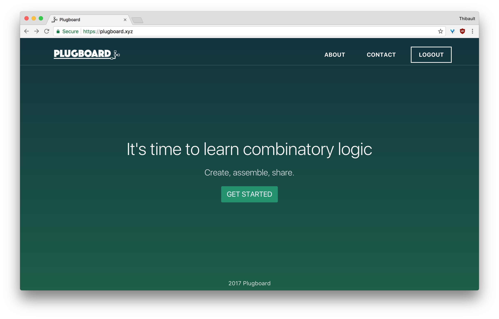
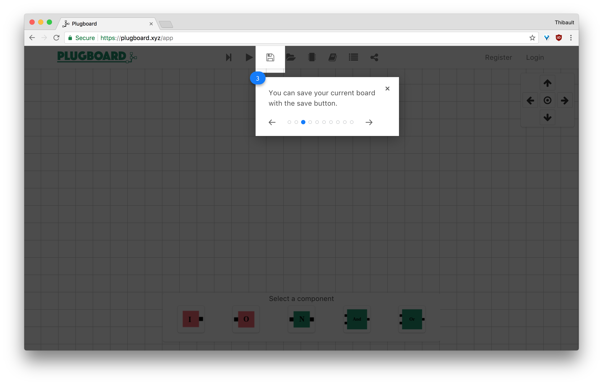
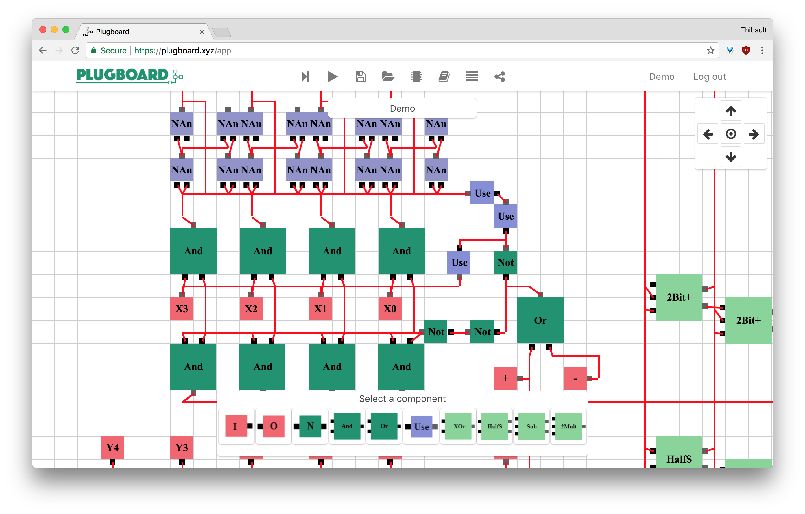
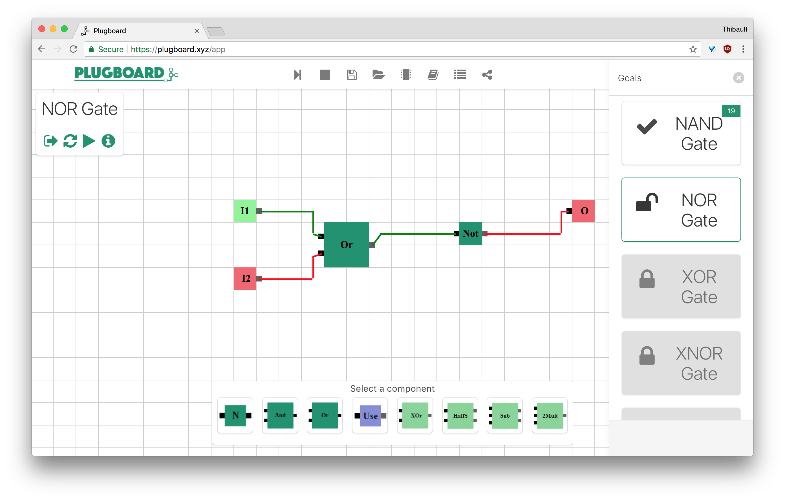
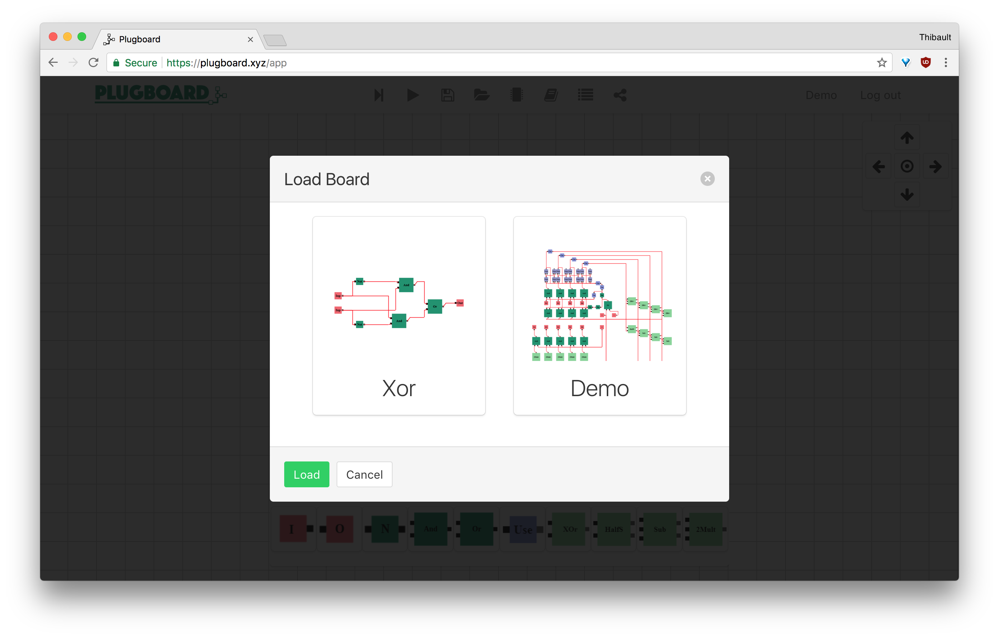
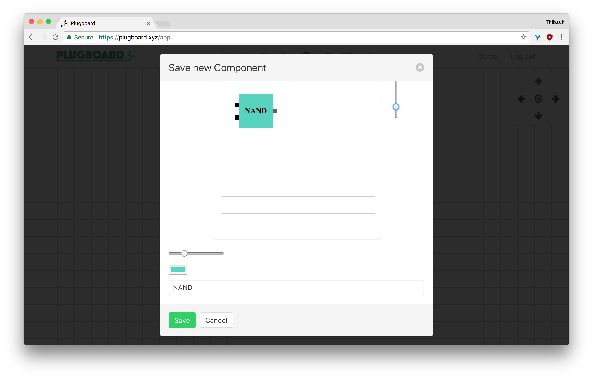
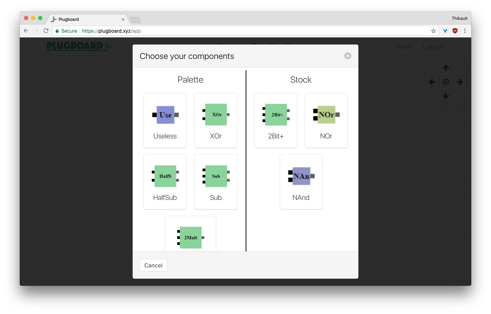

<p align="center">
  <a href="https://plugboard.xyz" target="_blank">
    
  </a>
  <br>
</p>

> Plugboard is a web platform to learn combinatory logic. Create, assemble, share!

## Features

* 🎨 **Be creative** in the sandbox mode
* 🎯 Learn combinatory logic with diverse **goals**
* 💾 **Load and save** your project
* 💡 Create component and **reuse them** in any project
* 📬 **Share** your component with the community

## Preview

|  | 
|:---:|:---:|
| Home page | Guided tour

 |
|:---:|
| Sandbox mode

 |
|:---:|
| Goal mode

|  |  |  |
|:---:|:---:|:---:|
| Load project | Create new component | Customize your palette

## Setup

Requirements:
- PHP 7
- Composer
- Node.Js
- Yarn
- MySQL
- MongoDB

```
# Setup the Laravel API
$ cp .env.example .env
$ mkdir -p bootstrap/cache
$ composer install
$ php artisan key:generate
$ php artisan migrate --seed
$ php artisan storage:link

# Setup the front-end
$ yarn
$ yarn run build

# Use Laravel Valet or `php artisan serve`
```